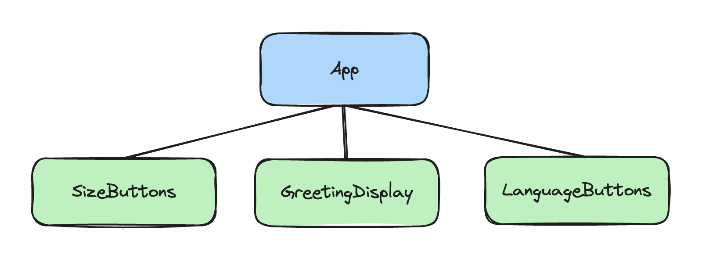

# Giphy Search

**Table of Contents**
- [Assignment Overview](#assignment-overview)
  - [Set Up](#set-up)
  - [Starter Code](#starter-code)
- [Tasks](#tasks)
  - [Get an API Key](#get-an-api-key)
    - [TODO 1](#todo-1)
  - [Adapters + handleFetch](#adapters--handlefetch)
    - [handleFetch.js](#handlefetchjs)
    - [giphyAdapters.js](#giphyadaptersjs)
    - [TODO 2](#todo-2)
  - [Use Adapters with useEffect \& Render the Gifs](#use-adapters-with-useeffect--render-the-gifs)
    - [TODO 3](#todo-3)
  - [Controlled Search Forms](#controlled-search-forms)
    - [TODO 4](#todo-4)
- [Tech Checklist](#tech-checklist)

## Assignment Overview

In this assignment, you will be building out a fun project to fetch Gifs from the GIPHY API. You'll be practicing the following skills
- working with an API key
- fetching from an API using the adapter pattern
- using React's `useEffect` hook
- rendering an array of data as a list
- creating a controlled form
- sharing state between components


Like the last assignment, there are no tests. Instead, there are technical requirements that your application must meet which means you will need to test your own code!

See the [Tech Checklist](#tech-checklist) below for explicit requirements.

### Set Up

For guidance on setting up and submitting this assignment, refer to the Marcy lab School Docs How-To guide for [Working with Short Response and Coding Assignments](https://marcylabschool.gitbook.io/marcy-lab-school-docs/fullstack-curriculum/how-tos/working-with-assignments#how-to-work-on-assignments).

After cloning your repository, make sure to create a `draft` branch:

```sh
git checkout -b draft
```

Then, do the following:

```sh
cd giphy-search
npm i
npm run dev
```

### Starter Code

There is a good amount of starter code created for you. Starting with the `App.jsx` component, take some time to draw out the component hierarchy using a tool like [https://excalidraw.com/](https://excalidraw.com/).

For example, here is a component hierarchy diagram of the Multilingual App that you built for the first assignment:



Once you've mapped out the component hierarchy, start building!

## Tasks

### Get an API Key

You will be using the [Giphy API](https://developers.giphy.com/docs/api#quick-start-guide) and will need to register for an API key.
- Create an account
- Create an API Key
- Copy the API Key

Then, head over to the [API Explorer](https://developers.giphy.com/explorer/) and see what the API returns!

The endpoints you should use for this project are the `/v1/gifs/trending` endpoint:

```
https://api.giphy.com/v1/gifs/trending?api_key=API_KEY&rating=g
```

and the `/v1/gifs/search` endpoint:

```
https://api.giphy.com/v1/gifs/search?api_key=API_KEY&q=QUERY&rating=g
```

The data returned by these endpoints will be an object with a `data` array of gif objects. Each gif will have an `images` array containing the URLs of the gifs to display.

When using these endpoints, DO NOT paste your API key directly into your code. Follow the next set of steps to properly hide your API key from GitHub.

It is a bad practice to push any code that exposes your API key to your repo. You NEVER want to deploy an app that does this in any way.

> NOTE: The technique below will not protect your API key if you were to deploy it. You need to deploy a backend to properly hide your API keys.

#### TODO 1
- Create a `config.js` file with the following (the name of the file is arbitrary):

```js
const API_KEY = "PASTE_YOUR_API_KEY_HERE";

export default API_KEY;
```

- Check out the `.gitignore` file and you will see that `config.js` has been listed. Therefore, any sensitive data you add to this file will NOT be published on GitHub.
- Wherever you need the `API_KEY`, import it from `config.js`

```js
import API_KEY from 'path/to/config.js'
```

### Adapters + handleFetch

An **adapter** is essentially a "transition layer" that connects two different interfaces. Think of it just like the power adapter (a.k.a. the "brick") that converts the USB-C connector on your charging cable to the standard three-prong electrical connector.

In our case, the adapter layer will provide functions for sending fetch requests to the APIs used by our application.

To support this pattern, we've provided a directory called **src/adapters/** for you.

#### handleFetch.js

This file exports a `handleFetch` helper function. This function's behavior should mostly be familiar to you. This particular implementation always returns a "tuple" — an array with two values: `[data, error]`. 

Open the **playground.js** file and run it with `node` to see how this function may be used throughout your application:

```js
import { handleFetch } from "./adapters/handleFetch.js";

const testHandleFetch = async () => {
  const [data, error] = await handleFetch('https://dog.ceo/api/breeds/image/random');
  if (error) {
    return console.log(error);
  }
  // no error means that our data was fetched!
  console.log(data);
}

testHandleFetch();
```

When we fetch, there are basically two outcomes: we get the data we fetched or an error is thrown. Rather than returning either the data OR the error, we return two values:
- If the fetch succeeds, the `data` value in the array will be the fetched `data` object while the `error` value will be `null`. 
- If an error is thrown, the `data` value in the array will be `null` while the `error` value will be the thrown `error` object.

By returning a tuple, the caller of this `handleFetch` helper is able to immediately know whether or not an `error` occurred. If the `error` exists, then we can easily handle it. If the `error` is `null`, then we know that the `data` was fetched successfully.

If we only returned a single value, either the data OR the error, then the caller of `handleFetch` would need to add their own logic to determine if they are receiving an error object or fetched data. Instead, the returned tuple makes this distinction abundantly clear.

#### giphyAdapters.js

This file exports two functions for fetching from various endpoints from the GIPHY API. Each function's sole purpose is to send a fetch request using the `handleFetch` helper and return the data in a desired format. 

For example, an adapter to fetch a dog image from the [Dog API](https://dog.ceo/dog-api/) might look like this:

```js
const getDogImageByBreed = (breed) => {
  const url = `https://dog.ceo/api/breed/${breed}/images/random`;
  const [data, error] = handleFetch(url);

  // The data returned will look like this: { "message": "image_url_to_dog_picture", "status": "success" }
  // The user of this adapter only cares about the message.
  return [data.message, error]
}
```

#### TODO 2

In **giphyAdapters.js**
- Import the API Key from your `config.js` file
- Complete the `getTrendingGifs` adapter to fetch from the `trending/` endpoint

  ```
  https://api.giphy.com/v1/gifs/trending?api_key={API_KEY}&rating=g
  ```

  It should return a tuple containing the first three `gifs` fetched from this endpoint and the `error` (remember, the `error` will be `null` if the fetch is successful).

- Complete the `getGifsBySearch` adapter to fetch from the `search/` endpoint based on a given `searchTerm`

  ```
  https://api.giphy.com/v1/gifs/search?api_key={API_KEY}&q={searchTerm}&rating=g
  ```

  It should return a tuple containing the first three `gifs` fetched from this endpoint and the `error` (remember, the `error` will be `null` if the fetch is successful).

In **playground.js**:
* Before continuing, test your completed adapter functions to ensure they work. 
* Import your functions and console log the results. 

```js
// in playground.js...
import { getTrendingGifs, getGifsBySearch } from "./adapters/giphyAdapters";

const testAdapters = async () => {
  const trendingTuple = await getTrendingGifs();
  const searchTuple = await getGifsBySearch();

  console.log(trendingTuple);
  console.log(searchTuple);
}

testAdapters();
```

* Run the playground file using `node`.

### Use Adapters with useEffect & Render the Gifs

Open **src/components/GifContainer.jsx**.

Once you have your adapters built, you will want to use them in the `GifContainer` component which will render the fetched gifs.

This component is meant to display gifs. However, there are two different sets of gifs that this component can display, depending on the user's actions. At first, they should see trending gifs but after submitting a search term in the GifSearch form, they should see gifs related to their search.

For now, we'll handle the trending gifs.

> Note: If you're struggling to get your fetching adapters to work with the GIPHY API, you can render the list of `defaultGifs` imported from the `src/gifs.json` file instead. The gifs in this file are in the same structure as the gifs you would receive when fetching from the GIPHY API.

#### TODO 3

- Use the `getTrendingGifs` adapter to fetch trending gifs on the first render (and only on the first render)
- The component should render the first three gifs returned from the `trending/` endpoint inside the `ul` as list items containing an `img` (did you know you can use `img` to render gifs??).
  - Remember to assign each list item a `key`

> TIP: Use `console.log` to print out the fetched gifs to see the data's structure. You should be looking for "original URL" of the image.

### Controlled Search Forms

Now that your app can render the trending gifs, we want to allow our users to search for gifs. Check out the `GifSearch` component.

This component is meant to contain a controlled form (a form whose input values) are controlled by a piece of React state (with `useState`). However, the final submitted value(s) of the form needs to be shared with the `GifContainer` so be careful about where you define your final submitted state!

#### TODO 4

- Convert the form in `GifSearch` into a controlled form.
- Handle form submissions by setting a `searchTerm` state value that can be shared with the `GifContainer` component (where should this state be defined? how can it be shared with `GifContainer`?)
- Once the `searchTerm` value is shared with the `GifContainer`, add an effect that uses the `getGifsBySearch` adapter to fetch and render the searched-for gifs any time that the `searchTerm` state is updated.

## Tech Checklist

There are 10 tasks to complete and 3 bonuses. As you work, return to this README file and check off each task by putting an `x` inside of the brackets `[ ]`.

Your goal is to meet at least 75% of these requirements to complete the assignment. But don't stop there! Shoot for 100%!

**Functionality:**
- [ ] When a user first loads the app, they should see 3 gifs from today's [Giphy API "Trending Gifs" endpoint](https://developers.giphy.com/docs/api/endpoint#trending).
- [ ] The user can search for gifs using the [Giphy API search endpoint](https://developers.giphy.com/docs/api/endpoint#search).
- [ ] The app updates the gifs on the page, displaying 3 at a time, **every time the user clicks the Find Gifs button**.
- [ ] Bonus: if an error occurs, the `defaultGifs` from `gifs.json` are displayed along with a message reading `"Sorry, the GIPHY API is not working, but here are some cats"`.

**React Fundamentals**
- [ ] Props are extracted in child components using destructuring
- [ ] `useState` is used to manage state
- [ ] `useEffect` is used to perform an asynchronous fetch call.
- [ ] The gifs are displayed as an unordered list (`ul`)
- [ ] Every `li` in the `ul` has a unique `key` prop
- [ ] The form is a controlled form.
- [ ] Bonus: modify the `useEffect` hook to be re-triggered whenever the user input changes (not just when they click the button).

**Miscellaneous**
- [ ] The `config.js` file is listed in the `.gitignore` and is NOT included in the final repository.
- [ ] At no point did you ever use any vanilla DOM JS methods (e.g. `document.querySelector` or `document.createElement`)
- [ ] Bonus: Display the gifs as a grid using flexbox or grid!
